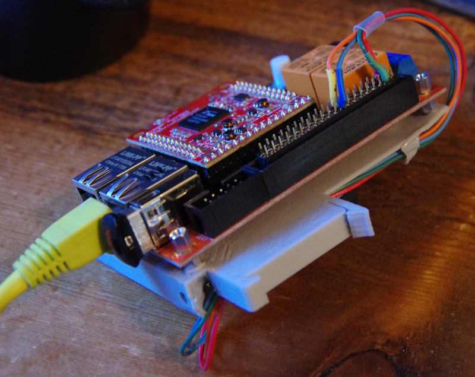

# UEXT AC Energy Monitor module

I'm developing this for use with an 
[Olimex board](https://www.olimex.com/Products/OLinuXino/RT5350F/RT5350F-OLinuXino-EVB/open-source-hardware)
that runs [OpenWrt](https://openwrt.org/toh/olimex/rt5350f-olinuxino-evb) and
has two GPIO-controlled relays, which I'm hoping to use as a pool pump
controller.  I want to be able to monitor the performance of the pool pump over
time, because this summer it started overheating and eventually failed.  It
would be nice to get an early warning when that's about to happen.  I was
searching and it seems that the 
[CS5490](https://www.cirrus.com/products/cs5490/) will fit the bill: it's 3.3V
powered, cheap enough, doesn't require much supporting circuitry, and works
with current transformers.  The little Olimex board ought to be a good
replacement for the old PC with a DS2413 relay connected to a DS9490 USB
adapter, that has been acting as a pool pump timer (and doing some other minor
home automation tasks) for a few years.

So far I have a working breakout board, designed with 
[KiCad](http://kicad-pcb.org/), that is successfully measuring AC current.  It
has a resistive voltage divider for measuring voltage too, but there is a
safety issue: the design requires connecting DC ground to the neutral wire,
while the other end of the voltage divider goes to line voltage.  Usually
embedded systems like this are kept "floating" behind a transformer or isolated
switching power supply.  I would prefer to measure the full 240VAC that the
pool pump runs on, for accurate power computation, but of course I'm not going
to connect the DC ground of this board (and consequently the ground of the
Olimex board) to a "hot" wire.  In either case, the isolation of the Ethernet
port would depend on the fact that (hopefully) the network jack is
transformer-coupled, because I certainly wouldn't want to cause ground loop
issues on the network either.

Measuring current might be good enough to monitor my pool pump (although it's
not satisfying not to get all the measurements this chip is capable of).  But
to really use it as an energy monitor for anything other than 120VAC US-type
circuits, an isolated design is needed.  I'm thinking my options are to let the
entire CS5490 chip run from an independent power supply and use optocouplers to
isolate the serial line, so that the Olimex board can have a floating DC
ground; or, run everything from a plain old step-down transformer, measure the
AC voltage coming from the transformer (before the rectifier), and calibrate
the CS5490 so that it thinks it's measuring the full AC voltage feeding the
transformer.  An AC brownout ought to result in a proportionately lower voltage
from the transformer; and I hope there is no phase difference significant
enough to affect the power computation.

It also turns out the RT5350F-OLinuXino-EVB has a design flaw: the 
[UEXT connector](https://www.olimex.com/Products/Modules/UEXT/) has a serial
port, but it's the same one that the OpenWrt firmware is using for the Linux
console!  So I can't use those serial lines for communicating with external
hardware (which I thought is supposed to be the main purpose of a UEXT
connector) unless I alter the firmware (or at least the kernel boot parameters)
to disable the serial console, which would also amount to "bricking" the board
if anything goes wrong with the network configuration.  But there's another
serial port on the 40-pin EXT4 connector.  So I designed my board to plug into
the UEXT connector, but now I need to redesign it to plug into the 40-pin
connector instead, which makes it less portable to other embedded systems.  And
also take care of the AC isolation problem somehow.

So now you know the caveats... you'd probably better not connect the line and
neutral screw terminals to anything, unless you know what you're doing.  But
measuring current with a current transformer is pretty safe AFAIK, and works
fine with this design.  I wrote a little test GUI with Qt to communicate with
the board using an FTDI adapter or something like that.  I also wrote another
test client using Lua 5.1 on the OpenWrt firmware, but it depends on being able
to use lua-rs232 at 600 baud (the default baud rate of the CS5490's serial
lines).  See 
[the issue about that](https://github.com/openwrt/packages/issues/10024).

A design for a 3D-printable DIN rail mounting solution is also included:

The hardware design is licensed under a 

[Creative Commons Attribution-ShareAlike 4.0 International License](http://creativecommons.org/licenses/by-sa/4.0/)
.

The software has a GPLv3 license.

